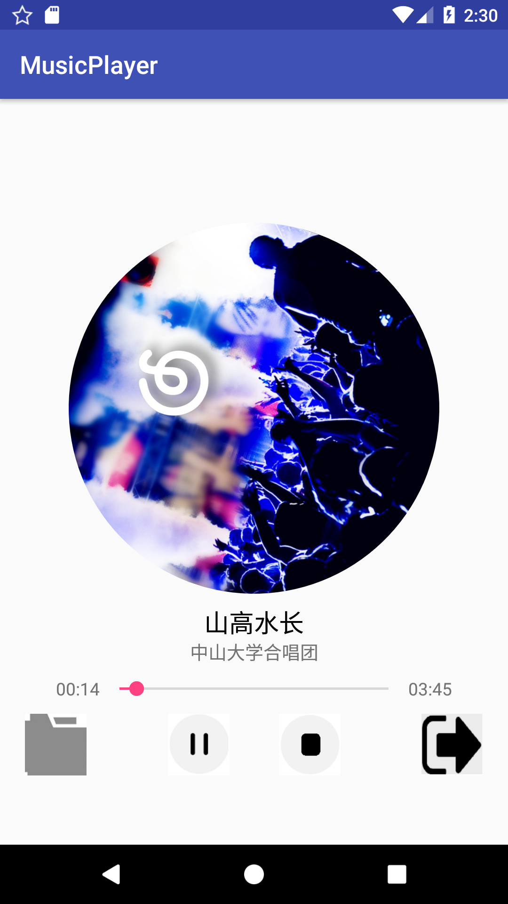
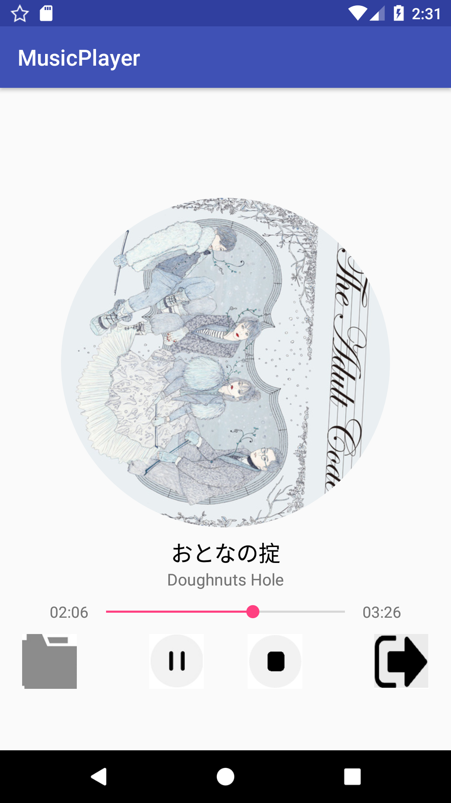

中山大学数据科学与计算机学院本科生实验报告

## （2018年秋季学期）
| 课程名称 | 手机平台应用开发 | 任课老师 | 郑贵锋 |
| :------------: | :-------------: | :------------: | :-------------: |
| 年级 |16级| 专业（方向） |软件工程|
| 学号 |16340031| 姓名 |陈涛|
| 电话 |136****3471| Email |bz20100405@163.com|
| 开始日期 |11月24日| 完成日期 |11月27日|

---

## 一、实验题目
简单的音乐播放器

---

## 二、实现内容
实现一个简单的播放器，要求功能有：
1. 播放、暂停、停止、退出功能，按停止键会重置封面转角，进度条和播放按钮；按退出键将停止播放并退出程序
2. 后台播放功能，按手机的返回键和home键都不会停止播放，而是转入后台进行播放
3. 进度条显示播放进度、拖动进度条改变进度功能
4. 播放时图片旋转，显示当前播放时间功能，圆形图片的实现使用的是一个开源控件CircleImageView

附加功能：
选歌：
用户可以点击选歌按钮自己选择歌曲进行播放，换歌后能正常实现上述的全部功能，选歌成功后不自动播放，重置播放按钮，重置进度条，重置歌曲封面转动角度。以及解析mp3文件，并更新封面图片。

---

## 三、课堂实验结果
### (1)实验截图
  

主页面播放时效果  

选择手机内的歌曲  
  播放自选歌曲，更新该专辑的封面，歌曲名和艺术家名称

为了允许应用访问storage，需要手动设置 

### (2)实验步骤以及关键代码

### 实验步骤
1. 完成UI设计部分
2. 完成service部分，实现播放功能
3. 进一步完善逻辑，修复播放器使用上的bug，如：播放卡顿，播放结束后的处理
### 关键代码
1. 使用开源控件CircleImageView
```xml
    <com.example.ct.musicplayer.CircleImageView
        android:id="@+id/musicImg"
        android:layout_width="300dp"
        android:layout_height="300dp"
        android:src="@drawable/img"
        app:layout_constraintLeft_toLeftOf="parent"
        app:layout_constraintRight_toRightOf="parent"
        app:layout_constraintTop_toTopOf="parent"
        android:layout_marginTop="100dp"/>
```
2. 使用SeekBar控件作为进度条
```xml
    <android.support.v7.widget.AppCompatSeekBar
        android:id="@+id/progress"
        android:layout_width="250dp"
        android:layout_height="20dp"/>
```
3. **Service部分**
首先在manifest注册service
```xml
<service android:name=".MusicService" android:exported="true"/>
```
通过Binder来保持Activity和Service的通信
```java
    public final IBinder binder = new MyBinder();
    public class MyBinder extends Binder {
        MusicService getService() {
            return MusicService.this;
        }
    }
```
在onCreate函数中，初次创建service时，读取assets中的校歌，创建对象并初始化：
```java
    AssetManager am = this.getAssets();
    AssetFileDescriptor afd = am.openFd("山高水长.mp3");  // 直接读取assets中的文件
    mediaPlayer.setDataSource(afd.getFileDescriptor(), afd.getStartOffset(),afd.getLength());
    mediaPlayer.prepare();
```
也可将assets中的初始音频文件直接拷贝到SD卡中，使用内部路径：
```java
    public String  CopyMusic(String MusicName) throws IOException {  // 将assets目录下的文件拷贝到SD卡中
        File dir = new File("data/data/com.example.ct.musicplayer/"+MusicName);
        if (!dir.exists() || !dir.isDirectory()) {
            dir.mkdir();
        }
        File file = new File(dir, MusicName);
        InputStream inputStream = null;
        OutputStream outputStream =null;
        if (!file.exists()) {
            try {
                file.createNewFile();
                inputStream = this.getClass().getClassLoader().getResourceAsStream("assets/" + MusicName);
                outputStream = new FileOutputStream(file);
                byte[] buffer = new byte[1024];
                int len ;
                while ((len = inputStream.read(buffer)) != -1) {
                    outputStream.write(buffer,0,len);
                }
            } catch (IOException e) {
                e.printStackTrace();
            }
            finally {
                if (outputStream != null) {
                    outputStream.flush();
                    outputStream.close();
                }
                if (inputStream != null) {
                    inputStream.close();
                }
            }
        }
        return file.getPath();
    }
```
在onBind函数中直接返回此Service的binder
```java
    public IBinder onBind(Intent intent) {
        return binder;  // 需要返回binder
    }
```
mediaPlayer播放与暂停的控制
```java
    public void start() {
        if (mediaPlayer.isPlaying()) {
            mediaPlayer.pause();
        } else {
            mediaPlayer.start();
        }
    }
```
mediaPlayer停止播放
```java
    public void stop() {
        if (mediaPlayer != null) {
            mediaPlayer.stop();
            try {
                mediaPlayer.prepare();
                mediaPlayer.seekTo(0);
            } catch (Exception e) {
                e.printStackTrace();
            }
        }
    }
```
mediaPlayer更换播放的歌曲
注意此处需要执行mediaPlayer.reset()，否则无法正常切换歌曲。mediaPlayer.setDataSource(path)的执行需要访问storage的权限，这里需要手动设置，也可以进行动态请求。
```java
    public void change_source(String path) {
        try{
            mediaPlayer.reset();             // 如果不reset会出错
            mediaPlayer.setDataSource(path); // 需要获得权限，manifest + 手动给权限
            mediaPlayer.prepare();
        } catch(IOException e) {
            e.printStackTrace();
        }
    }
```
4. **MainActivity部分**
调用bindService保持与Service的通信，这里没有使用ta教程里用的BIND_AUTO_CREATE，因为这样会在绑定的同时创建service。但是当service已经在后台运行时，实际上应该去使用这个已经存在的Service，而不是重新创建一个。使用参数0就可以只进行Service的绑定。
这里需要实现一个判断我们的Service是否在运行的函数isServiceRunning，如果没有运行，我们则需要调用startService来启动service。如果绑定了已经存在的service，就先把UI做一些基本调整(如让专辑封面旋转)。并设置update变量，在之后的handler进行判断，如果是绑定了已有的service，还需要更新专辑和歌曲信息。
```java
        intent = new Intent(this, MusicService.class);
        if(!isServiceRunning(this, "com.example.ct.musicplayer.MusicService")) {
            startService(intent);
            bindService(intent, sc, 0);
        }
        else{
            bindService(intent, sc, 0);
            animator.start();
            start = true;
            has_started = true;
            ImageButton ib = findViewById(R.id.play);
            ib.setBackgroundResource(R.drawable.pause);
            update = false;
        }
```
判断指定Service是否正在运行的函数
```java
    public static boolean isServiceRunning(Context context,String serviceName) {
        // 校验服务是否还存在
        ActivityManager am = (ActivityManager) context
                .getSystemService(Context.ACTIVITY_SERVICE);
        List<ActivityManager.RunningServiceInfo> services = am.getRunningServices(100);
        for (ActivityManager.RunningServiceInfo info : services) {
            // 得到所有正在运行的服务的名称
            String name = info.service.getClassName();
            System.out.println(info.service.getClassName());
            if (serviceName.equals(name)) {
                return true;
            }
        }
        return false;
    }
```
定义ServiceConnection,bindService成功后回调onServiceConnected函数，通过IBinder获取Service对象，实现Activity与Service的绑定
```java
    private ServiceConnection sc = new ServiceConnection() {
        @Override
        public void onServiceConnected(ComponentName name, IBinder service) {
            ms = ((MusicService.MyBinder) service).getService();
        }
        @Override
        public void onServiceDisconnected(ComponentName name) {
        }
    };
```
使用handler进行UI的更新
首先在OnCreate函数中mHandler.post(mRunnable)第一次触发handler。然后在Runnerable的run函数中会执行mHandler.postDelayed(mRunnable, 1000)，相当于每隔1s又执行一次run函数，从而能够在run中进行持续的UI更新。UI的更新主要包括设定进度条seekBar的位置Progress和当前时间TextView的更新，当然其他不需要重复设置的部分（如设置进度条时长的TextView）放在其中也无妨，没有明显地影响性能。
使用ms.mediaPlayer.getCurrentPosition() >= ms.mediaPlayer.getDuration()判断是否音乐播放是否结束（最终的position可能会比最大值要大），结束后重置进度条，当前播放时间以及动画等。
如果最初绑定的是已经存在的service，则还需要更新歌曲信息（专辑封面，名称，艺术家）。
```java
public void run() {
        mHandler.postDelayed(mRunnable, 1000);
        if (ms != null) {
            if(!update && !ms.path.equals("")) {
                MediaMetadataRetriever mmr = new MediaMetadataRetriever();
                mmr.setDataSource(ms.path);
                String title =  mmr.extractMetadata(MediaMetadataRetriever.METADATA_KEY_TITLE);
                String author = mmr.extractMetadata(MediaMetadataRetriever.METADATA_KEY_ARTIST);
                byte[] d = mmr.getEmbeddedPicture();
                Bitmap bitmap = BitmapFactory.decodeByteArray(d, 0, d.length);
                TextView title_text = findViewById(R.id.title);
                TextView author_text = findViewById(R.id.author);
                CircleImageView music_img = findViewById(R.id.musicImg);
                title_text.setText(title);
                author_text.setText(author);
                music_img.setImageBitmap(bitmap);
                update = true;
            }
            seekBar.setMax(ms.mediaPlayer.getDuration());
            seekBar.setProgress(ms.mediaPlayer.getCurrentPosition());
            current.setText(time.format(ms.mediaPlayer.getCurrentPosition()));
            end.setText(time.format(ms.mediaPlayer.getDuration()));
            if(ms.mediaPlayer.getCurrentPosition() >= ms.mediaPlayer.getDuration()) {  // 播放结束
                seekBar.setProgress(0);
                animator.end();
                ImageButton ib = findViewById(R.id.play);
                ib.setBackgroundResource(R.drawable.play);
                current.setText("00:00");
                start = false;
                has_started = false;
            }
        }
    }
```
定义seekBar监听事件，监听用户对进度条的拖拽
```java
    seekBar.setOnSeekBarChangeListener(new SeekBar.OnSeekBarChangeListener() {
        @Override
        public void onProgressChanged(SeekBar seekBar, int progress, boolean fromUser) {
            if (fromUser) {
                ms.mediaPlayer.seekTo(seekBar.getProgress());  // 如果没有fromUser判断，则会不断执行，造成卡顿
            }
        }

        @Override
        public void onStartTrackingTouch(SeekBar seekBar) {

        }

        @Override
        public void onStopTrackingTouch(SeekBar seekBar) {
        }
    });
```
ImageView滚动动画
使用ObjectAnimator,可以方便地进行动画的开始start，暂停pause，中止end，继续resume，不过需要注意，只有start之后才能resume来重启暂停的动画，而重复的start会让动画每次都重新开始。
```java
	CircleImageView img = findViewById(R.id.musicImg);
	animator = ObjectAnimator.ofFloat(img, "rotation", 0f, 360f);
	animator.setDuration(8000);		// 转指定角度的时间（上面定义为一周360）
	animator.setInterpolator(new LinearInterpolator()); // 动画匀速执行
	animator.setRepeatCount(-1);  // 无限循环
```
结束播放
重置进度条，当前播放时间，终止mediaPlayer等
```java
    public void stop(View view) {    // 结束播放
        ImageButton ib = findViewById(R.id.play);
        ms.stop();
        SeekBar seekBar = findViewById(R.id.progress);
        seekBar.setProgress(0);
        TextView current = findViewById(R.id.start);
        current.setText("00:00");
        start = false;
        ib.setBackgroundResource(R.drawable.play);
        animator.end();
        has_started = false;
    }
```
开始/暂停播放
使用has_started变量来判断动画是否已经开始过，如果没有，启动动画使用start。如果开始过，启动动画使用resume。
```java
    public void start(View view) {   // 开始，暂停
        ms.start();  // 由Service进行判断当前是否在播放
        ImageButton ib = findViewById(R.id.play);
        if (!start) {
            start = true;
            ib.setBackgroundResource(R.drawable.pause);
            if (has_started)  
                animator.resume();
            else
                animator.start();
        } else {
            start = false;
            ib.setBackgroundResource(R.drawable.play);
            animator.pause();
        }
        has_started = true;
    }
```
退出应用
结束handler任务，并中止对Service的绑定，以及停止Service的运行
```java
    public void back(View view) {   // 退出
        mHandler.removeCallbacks(mRunnable);
        unbindService(sc);
        try {
            MainActivity.this.finish();
            stopService(intent); //  停止Service
            System.exit(0);
        } catch (Exception e) {
            e.printStackTrace();
        }
    }
```
**额外内容**
自选歌曲
```java
    public void load(View view) {
        Intent intent = new Intent(Intent.ACTION_GET_CONTENT);
        intent.setType("audio/*");
        intent.addCategory(Intent.CATEGORY_OPENABLE);
        startActivityForResult(intent, 1);
    }
```
获取歌曲路径，并从中获取歌曲相关信息，如专辑封面，歌曲名，艺术家名称。并在service存储歌曲的路径，如果之后绑定了在后台运行的service，可以借此获取到歌曲的这些信息并进行更新。
```java
    protected void onActivityResult(int requestCode, int resultCode, Intent data) {
        if (resultCode == Activity.RESULT_OK) {
            Uri uri = data.getData();
            if ("file".equalsIgnoreCase(uri.getScheme())){//使用第三方应用打开
                path = uri.getPath();
                return;
            }
            if (Build.VERSION.SDK_INT > Build.VERSION_CODES.KITKAT) {//4.4以后
                path = getPath(this, uri);
            } else {//4.4以下下系统调用方法
                path = getRealPathFromURI(uri);
            }
            View t= null;
            stop(t);  // 停止播放
            MediaMetadataRetriever mmr = new MediaMetadataRetriever();
            mmr.setDataSource(path);
            String title =  mmr.extractMetadata(MediaMetadataRetriever.METADATA_KEY_TITLE);
            String author = mmr.extractMetadata(MediaMetadataRetriever.METADATA_KEY_ARTIST);
            byte[] d = mmr.getEmbeddedPicture();
            Bitmap bitmap = BitmapFactory.decodeByteArray(d, 0, d.length);
            TextView title_text = findViewById(R.id.title);
            TextView author_text = findViewById(R.id.author);
            CircleImageView music_img = findViewById(R.id.musicImg);
            title_text.setText(title);
            author_text.setText(author);
            music_img.setImageBitmap(bitmap);
            ms.change_source(path);
            has_started = false;
            ms.path = path; 
        }
    }
```
辅助函数如下，参考自ta提供的博客
```java
public String getRealPathFromURI(Uri contentUri) {
        String res = null;
        String[] proj = { MediaStore.Images.Media.DATA };
        Cursor cursor = getContentResolver().query(contentUri, proj, null, null, null);
        if(null!=cursor&&cursor.moveToFirst()){;
            int column_index = cursor.getColumnIndexOrThrow(MediaStore.Images.Media.DATA);
            res = cursor.getString(column_index);
            cursor.close();
        }
        return res;
    }

    @SuppressLint("NewApi")
    public String getPath(final Context context, final Uri uri) {

        final boolean isKitKat = Build.VERSION.SDK_INT >= Build.VERSION_CODES.KITKAT;

        // DocumentProvider
        if (isKitKat && DocumentsContract.isDocumentUri(context, uri)) {
            // ExternalStorageProvider
            if (isExternalStorageDocument(uri)) {
                final String docId = DocumentsContract.getDocumentId(uri);
                final String[] split = docId.split(":");
                final String type = split[0];

                if ("primary".equalsIgnoreCase(type)) {
                    return Environment.getExternalStorageDirectory() + "/" + split[1];
                }
            }
            // DownloadsProvider
            else if (isDownloadsDocument(uri)) {

                final String id = DocumentsContract.getDocumentId(uri);
                final Uri contentUri = ContentUris.withAppendedId(
                        Uri.parse("content://downloads/public_downloads"), Long.valueOf(id));

                return getDataColumn(context, contentUri, null, null);
            }
            // MediaProvider
            else if (isMediaDocument(uri)) {
                final String docId = DocumentsContract.getDocumentId(uri);
                final String[] split = docId.split(":");
                final String type = split[0];

                Uri contentUri = null;
                if ("image".equals(type)) {
                    contentUri = MediaStore.Images.Media.EXTERNAL_CONTENT_URI;
                } else if ("video".equals(type)) {
                    contentUri = MediaStore.Video.Media.EXTERNAL_CONTENT_URI;
                } else if ("audio".equals(type)) {
                    contentUri = MediaStore.Audio.Media.EXTERNAL_CONTENT_URI;
                }

                final String selection = "_id=?";
                final String[] selectionArgs = new String[]{split[1]};

                return getDataColumn(context, contentUri, selection, selectionArgs);
            }
        }
        // MediaStore (and general)
        else if ("content".equalsIgnoreCase(uri.getScheme())) {
            return getDataColumn(context, uri, null, null);
        }
        // File
        else if ("file".equalsIgnoreCase(uri.getScheme())) {
            return uri.getPath();
        }
        return null;
    }

    public String getDataColumn(Context context, Uri uri, String selection,
                                String[] selectionArgs) {

        Cursor cursor = null;
        final String column = "_data";
        final String[] projection = {column};

        try {
            cursor = context.getContentResolver().query(uri, projection, selection, selectionArgs,
                    null);
            if (cursor != null && cursor.moveToFirst()) {
                final int column_index = cursor.getColumnIndexOrThrow(column);
                return cursor.getString(column_index);
            }
        } finally {
            if (cursor != null)
                cursor.close();
        }
        return null;
    }

    public boolean isExternalStorageDocument(Uri uri) {
        return "com.android.externalstorage.documents".equals(uri.getAuthority());
    }

    public boolean isDownloadsDocument(Uri uri) {
        return "com.android.providers.downloads.documents".equals(uri.getAuthority());
    }

    public boolean isMediaDocument(Uri uri) {
        return "com.android.providers.media.documents".equals(uri.getAuthority());
    }
```
### (3)实验遇到的困难以及解决思路
1. 引入Service播放音乐时，发现MainActivity获取的MusicService始终为null。检查Service代码后发现onBind函数的返回值之前只是临时写了个null，而没有返回Service的binder。修正之后就可以正确播放音乐了。
2. 在Service实现切换音乐功能时，首先是出现崩溃的问题。怀疑可能是重复设置了mediaPlayer的DataSource造成的，所以需要把之前的Source清空。查找了一下，reset函数可以起到这个效果，解决了崩溃的问题。然后发现歌曲还是没有切换，检查run的log，发现有permission denied字样，那就应该是权限问题了。首先在manifest文件里添加对storage的访问权限请求：
``` xml
<uses-permission android:name="android.permission.WRITE_EXTERNAL_STORAGE"/>
```
然后在设置里找到这个应用，允许访问storage的权限。问题就解决了。
3. 如何判断音乐已经播放结束
一开始使用 ms.mediaPlayer.getCurrentPosition() == ms.mediaPlayer.getDuration()，发现无法检测到音乐播放结束，然后使用ms.mediaPlayer.isPlaying()函数，发现暂停时也会触发处理。想在暂停时removeCallback来删除handler的runnable，开始时再post，但感觉这样实现过于复杂。后来使用ms.mediaPlayer.getCurrentPosition() >= ms.mediaPlayer.getDuration()来进行判断，解决了问题，因为最终的位置是可能比最大值还要大的。
4. 听音频时总感觉有卡顿以及噪声，噪声只有当我同步使用电脑（如继续改代码）时才会产生，所以应该是虚拟机的问题。然后卡顿的现象在加入进度条监听事件都没有出现，查询之后发现需要使用fromUser变量，只关心来自用户的操作。否则进度条一改变，就响应一次，极大地降低性能，造成卡顿
```java
public void onProgressChanged(SeekBar seekBar, int progress, boolean fromUser) {
        if (fromUser) {
            ms.mediaPlayer.seekTo(seekBar.getProgress());  // 如果没有fromUser判断，则会不断执行，造成卡顿
        }
    }
```
5. 控制ImageVIew的滚动动画时，一开始采用RotateAnimation，然而没有找到合适的方法来控制动画暂停，然后更换了类似的ObjectAnimator，就有很方便的接口，开始start，暂停pause，中止end，继续resume。 然而因为动画初始时直接resume无法启动动画，重复的start会让动画每次从头开始，而我们需要动画随时暂停，并在那个角度重新开始。所以第一次启动动画时要执行start，中途要执行resume。关于这个逻辑，一开始尝试使用进度条的位置判断歌曲是否已经开始，然而可能歌曲还没开始，用户拖动了进度条，导致动画不再执行start。所以还是选择使用本地变量has_start来存储状态。
6. 当应用退到后台时，重新运行应用后，又重新创建了一个service，结果就是两首歌同时播放。所以需要进行判断，如果service已经存在（放在后台运行），那么不再创建service，而是绑定这个正在运行的service。另外，还需要从这个service中获取歌曲的相关信息，并进行更新。

---

## 四、课后实验结果
  
  
  
  

---

## 五、实验思考及感想
```
	实现了音乐播放器的应用，与之前UWP的任务类似，只不过当时还要实现视频的播放。这次作业学习到的新技术中，handler比较有意思。Handler与UI是同一线程，可以通过Handler更新UI上的组件状态。一开始handler这个名称以及run函数让我误以为这是个多线程的实现方法，于是使用while(true)+sleep来进行持续更新，然而应用直接卡死。思考之后，使用自调用的postDelay来实现循环执行。然后这次CircleImageView直接使用了开源的控件，大大减少了工作量。在做期中项目的铭文模拟器那部分时，大费周折自定义了六边形的view来显示铭文。可能找一找开源控件也能找到六边形的ImageView实现，并且使用这些开源控件还能够让代码更加健壮。
```

---